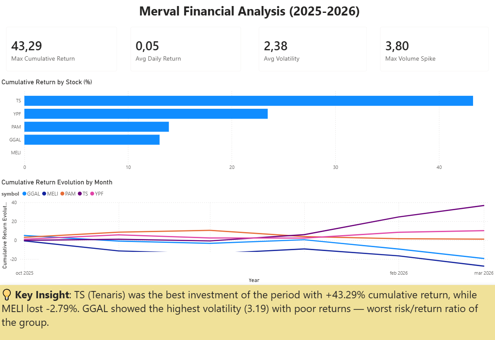
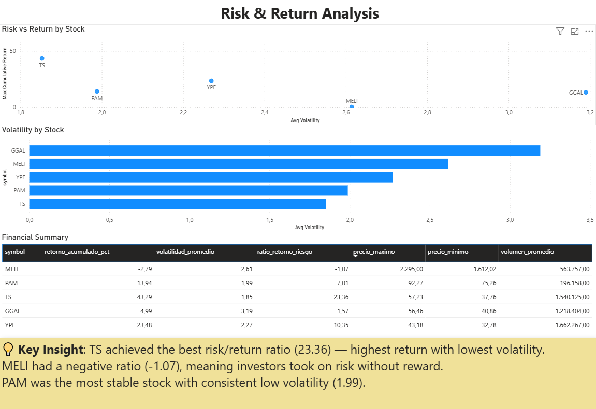
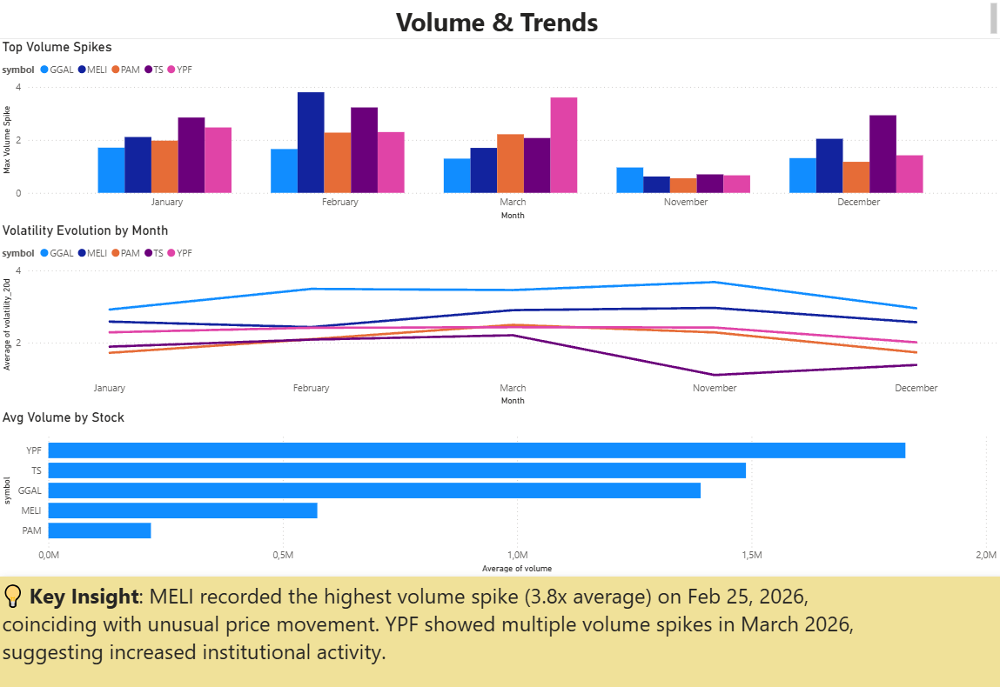

# Merval Financial Analysis 📈

End-to-end financial analysis pipeline using real market data from Alpha Vantage API.

## Business Questions
- Which Merval stock had the best return in the last 100 days?
- Which stock was the riskiest?
- When did unusual volume spikes occur?
- Which stock has the best risk/return ratio?

## Key Insights
- 📈 TS (Tenaris) was the best investment with +43.29% cumulative return and lowest volatility (1.85)
- 📉 MELI had a negative risk/return ratio (-1.07) — risk with no reward
- 🔊 MELI recorded the highest volume spike (3.8x average) on Feb 25, 2026
- ⚠️ GGAL showed the highest volatility (3.19) with poor returns — worst risk/return ratio
- 📊 YPF showed multiple volume spikes in March 2026, suggesting institutional activity

## Tech Stack
- **Python** (pandas, requests) — API consumption & ETL pipeline
- **Alpha Vantage API** — real-time market data
- **SQL Server** — data storage and analytical queries
- **Power BI** — interactive dashboard

## Project Structure
```
merval-financial-analysis/
├── notebooks/
│   ├── 01_eda.ipynb        # Exploratory Data Analysis
│   └── 02_etl.ipynb        # ETL Pipeline & metrics calculation
├── sql/
│   └── 01_analisis_financiero.sql  # Analytical queries & view
├── images/                 # Dashboard screenshots
└── .gitignore
```

## Dataset
Real market data extracted via [Alpha Vantage API](https://www.alphavantage.co/) — 100 days of daily prices for YPF, GGAL, MELI, TS and PAM.

## Dashboard Preview

### Market Overview


### Risk & Return Analysis


### Volume & Trends

